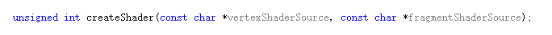

# 计算机图形学-平时作业六

## 一、运行结果
- Phong Shading

- Gouraud Shading

## 二、两种Shading的实现原理
这两个Shading的实现都是基于 **Phong光照明模型** 。其中Phong Shading在 **FragmentShader** 中实现Phong光照明模型，而Gouraud Shading在 **VerticesShader** 中实现Phong光照明模型。
### Phong光照明模型
Phong光照明模型中的光照是指 **环境光+漫反射光+镜面反射光**的结果。最后将得到的光的结果与物体颜色做点积的到物体应该显示的颜色。  
1. **环境光**  
   计算公式：   
      

2. **反射**  

   根据**朗博余弦定理**进行漫反射光照结果计算。    
   计算公式：  
        
   其中l为所求光照的物体表面的点指向光源的方向的单位向量，n为物体表面的单位法向量。   

3. **镜面反射**   
  计算公式如下图所示：  
  

4. **物体颜色显示**   
  物体的颜色显示为前面三个的计算结果的和与物体颜色的点积。

## 三、相关函数
1. 实现两种shading的切换
  创建两个shaderProgram分别对应Phong Shading和Gouraud Shading，要是用哪一个 shading 就使用相对应的shaderProgram。为了简化创建shaderProgram的重复代码，实现函数**createShader**。    
    
  此函数返回shaderProgram。
2. 为了简化对shader中生命的 **uniform** 变量进行赋值实现下面的三个函数  
    
  上述三个函数中输入的参数 **ID** 是指 **ShaderProgram** ;而 **name** 代表的是 **uniform** 变量的变量名; **value** 是指将对应变量赋值的值。
3. 实现光源随着时间旋转  
    
  根据时间的变换修改 **lightPos** 的值，之后再 **model** 矩阵中进行操作来修改光源的位置。

## 四、演示视频地址
[视频链接](www.bilibili.com/video/av51761408/)
