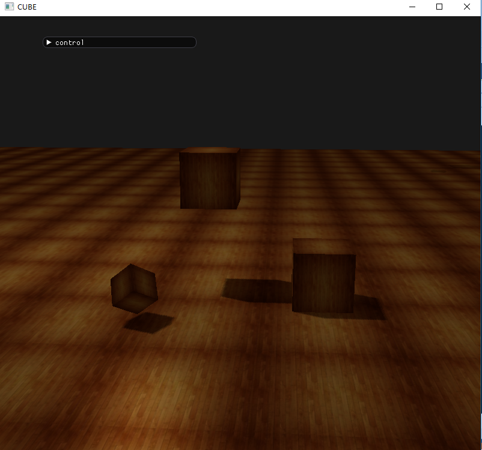
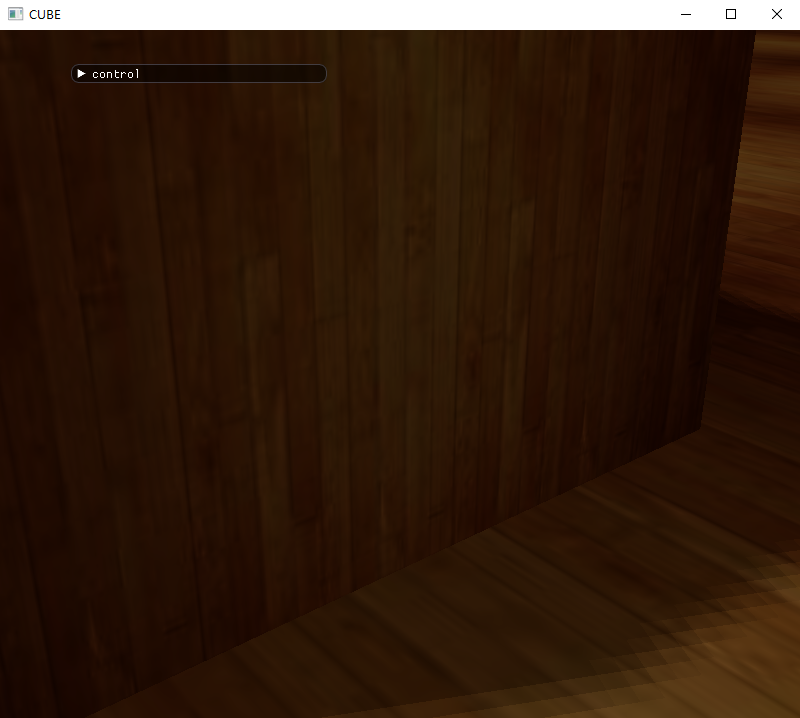
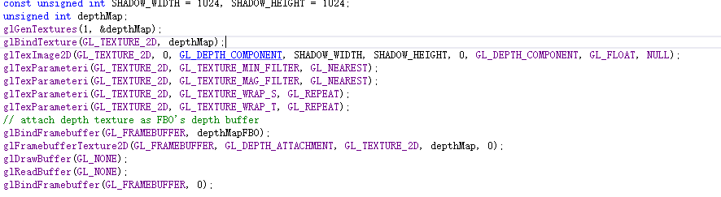
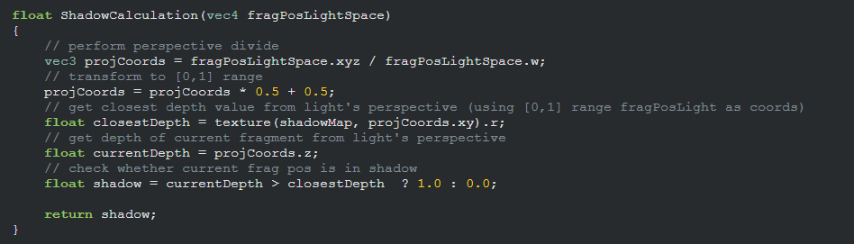
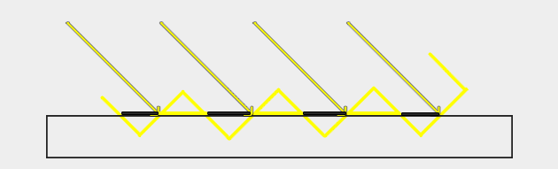
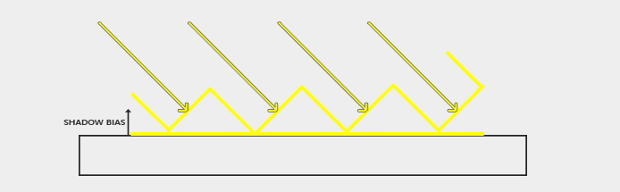

# 计算机图形学 作业七

###  一、运行结果

 





### 二、相关函数介绍

1. 函数 `renderCube()`，此函数用于渲染一个立方体，根据两个全局变量来判断当前是否是第一次调用这个函数，如果是则根据顶点数组生成对应的VAO和VBO，并且解析指针，否则就直接渲染立方体。

2. 函数 `void renderScene(const unsigned int &shaderID)`, 此函数用于渲染整个场景。此函数使用传给此函数的shader的ID来渲染场景。通过给shader的model矩阵赋不同的值来修改立方体的大小、位置等。同时根据全局变量来判断是否是第一次调用这个函数，如果是则根据相应的顶点数组生成平面的VAO和VBO，否则就直接进行渲染。

3. 函数 `unsigned int loadTexture(char const * path);` ,此函数用于加载指定路径的图片作为一个纹理，并返回改纹理的ID。

4. 函数 `unsigned int createShader(const char *vertexShaderSource, const char *fragmentShaderSource);`， 此函数用于创建一个shaderProgram并且返回。

5. 下面四个函数用于修改指定shaderProgram中 **uniform** 变量的值
	```c++
	void setShaderMat4(unsigned int ID, const std::string &name, const glm::mat4 &value);  
	void setShaderVec3(unsigned int ID, const std::string &name, const glm::vec3 &value);  
	void setShaderFloat(unsigned int ID, const std::string &name, const float &value);  
	void setShaderInt(unsigned int ID, const std::string &name, int value);  
	```

### 三、实现过程

#### 计算深度图，并生成深度贴图纹理
此过程将把光源的位置当成camera的位置进行场景的渲染。
1. 生成一个帧缓存的ID：
```c++
unsigned int depthMapFBO;
glGenFramebuffers(1, &depthMapFBO);  
```
2. 创建一个要附加给帧缓存的深度缓存纹理,并将其附加到帧缓存上，要注意调整此时的视觉窗口的大小:


3. 将视觉空间转换到光源空间：
```c++
		glm::mat4 lightProjection, lightView;  
		glm::mat4 lightSpaceMatrix;  
		float near_plane = 1.0f, far_plane = 7.5f;  
		lightProjection = glm::ortho(-10.0f, 10.0f, -10.0f, 10.0f, near_plane, far_plane);  
		lightView = glm::lookAt(lightPos, glm::vec3(0.0f), glm::vec3(0.0, 1.0, 0.0));  
		lightSpaceMatrix = lightProjection * lightView;  
```

4. 写好相应的着色器，并把 `lightSpaceMatrix` 传给着色器进行处理， 进行渲染场景就能的到所求的深度图。  **shader代码的书写详见 shaderSource.h**

#### 进行场景的正常渲染
camera在任意位置进行场景的渲染。  

1. 在顶点着色器中对顶点进行变换。一是将点变为正常的视觉空间中的点，二是将点变为光源空间的点，并将结果传给片段着色器。

2. 在片段着色器中进行光照计算，并添加 **shadow** 变量来判断当前点是在阴影中还是阴影外，如果在阴影中，就只渲染环境光；如果不在阴影中，就加上漫反射和镜面反射的渲染。因此光照的公式修改为如下：   
`lighting = (ambient + (1.0 - shadow) * (diffuse + specular)) * color `

3. 检查像素是否在阴影中
	根据 shadow mapping 算法，使用透视除法，将裁剪空间的坐标标准化，范围[-1,1]。之后，由于深度贴图的坐标范围为[0, 1]，因此通过公式 `projCoords = projCoords * 0.5 + 0.5` 进行映射,之后从深度贴图中采样，得到光透视空间的最近深度，并将片元的当前深度与之比较，如果最近深度更小，则该点在阴影中；否则，该点不在阴影中。

4. shading mapping 算法在shader中的具体实现即计算 **shadow** 的值的部分
	


### 四、Bonus
1. 阴影偏移  
  

  如上图，由于阴影贴图受分辨率限制，因此当多个片段距离光源相对较远时，可以从深度贴图中采样相同的值。 图像显示了每个倾斜面板代表深度图的单个纹理像素的地板。 可以看到，几个片段采样相同的深度样本。
  虽然这通常是可以的，但是当光源看向朝向表面的角度时它变成问题，因为在那种情况下深度图也从角度渲染。 然后几个碎片进入相同的倾斜深度纹理元素，而一些碎片位于地板上方，一些位于地板下方; 我们得到一个阴影差异。 因此，一些片段被认为是阴影而一些不是。

  可以通过添加一个偏移来解决这个问题。添加偏移后：
  

  代码修改：
  ```c++
  float bias = 0.005f;
  float shadow = currentDepth - bias > pcfDepth ? 1.0 : 0.0;
  ```

2. 消除锯齿  
  通过从深度贴图中多次采样取平均值的方式来产生更柔和阴影。代码中采用从像素的八邻域中采样，类似于做一个均值模板的3*3模板的卷积。

  代码中的实现：

  ```c++
  float shadow = 0.0;
  vec2 texelSize = 1.0 / textureSize(shadowMap, 0);
  for(int x = -1; x <= 1; ++x)
  {
  	  for(int y = -1; y <= 1; ++y)
  	  {
  	      float pcfDepth = texture(shadowMap, projCoords.xy + vec2(x, y) * texelSize).r; 
    	    shadow += currentDepth - bias > pcfDepth  ? 1.0 : 0.0;        
   	 }    
  }
  shadow /= 9.0;
  ```
  使用后结果：   
  