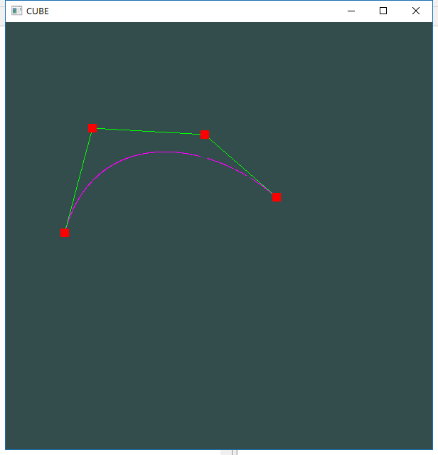

# 计算机图形学 作业8

### 一、运行结果
1. 画线的结果  
	
2. 画线的过程  
	  
	

### 二、相关函数介绍
1. `void cursor_pos_callback(GLFWwindow* window, double xpos, double ypos);`  
	这个函数是鼠标移动事件的回调函数，用于获取鼠标的坐标（处理后）赋值给全局变量。

2. `void mouse_button_callback(GLFWwindow* window,int button, int action, int mods);`  
	此函数是鼠标点击事件的回调函数，用于处理鼠标左键点击添加控制点，鼠标右键点击删除控制点。

3. `void renderPoint();`  
	此函数用于画出控制顶点用一个小的正方形表示。

4. `void renderLine(const std::vector<float> &vertices);`  
	此函数用于画出连接控制顶点之间的连线

5. `void renderAssiantLine(const std::vector<float> &controlPoint,const float t)`  
	此函数用于画出生成bezier曲线所需要画出的辅助线段，其中t是参数，t的值根据时间来计算。

6. `void renderBezier(const std::vector<float> &point);`
	此函数根据在上面一个函数中计算所得的属于bezier曲线中的点来画出bezier曲线。

### 三、实现过程  
  
主要过程如上图所示。使用vector容器来存储控制顶点的坐标，每相邻两个vector中的对象作为一个点的坐标。对输入的控制定点进行迭代，并且在每一次迭代中连接剩余的点，直到最终只剩下一个点时停止迭代，同时这一个点依旧是所求 **bezier曲线** 中的点，将其存储于 **points** 中，之后在画出来即可。
